# MooncakeConnector KV Cache Transfer Sequence Diagram

This document illustrates the complete workflow for transferring KV caches between instances using the MooncakeConnector in a disaggregated prefill/decode setup.

## Sequence Diagram

```mermaid
sequenceDiagram
    participant Scheduler
    participant SchedConnector as MooncakeConnector<br/>(Scheduler Role)
    participant SchedImpl as MooncakeConnectorScheduler
    participant Worker
    participant WorkerConnector as MooncakeConnector<br/>(Worker Role)
    participant WorkerImpl as MooncakeConnectorWorker
    participant ModelRunner
    participant KVManager as KV Cache Manager
    participant MooncakeEngine as Mooncake TransferEngine
    participant RemotePrefiller as Remote Prefiller<br/>(ZMQ + Mooncake)
    participant RemoteDecoder as Remote Decoder<br/>(ZMQ + Mooncake)

    Note over Scheduler,RemoteDecoder: Phase 1: Initialization
    rect rgb(240, 248, 255)
        Scheduler->>SchedConnector: ensure_kv_transfer_initialized()<br/>KVConnectorFactory.create_connector()
        SchedConnector->>SchedImpl: __init__(vllm_config, engine_id)
        Note right of SchedImpl: Initialize side channel<br/>host/port
        
        Worker->>WorkerConnector: ensure_kv_transfer_initialized()<br/>KVConnectorFactory.create_connector()
        WorkerConnector->>WorkerImpl: __init__(vllm_config, engine_id)
        WorkerImpl->>MooncakeEngine: TransferEngine.initialize()<br/>protocol="rdma"
        MooncakeEngine-->>WorkerImpl: rpc_port
        Note right of WorkerImpl: Start background threads:<br/>- sender_listener<br/>- receiver_loop
        
        ModelRunner->>WorkerConnector: register_kv_caches(kv_caches)
        WorkerConnector->>WorkerImpl: register_kv_caches(kv_caches)
        WorkerImpl->>MooncakeEngine: batch_register_memory(kv_data_ptrs, kv_data_lens)
        WorkerImpl->>WorkerImpl: Start sender listener thread<br/>on side_channel_port
        Note right of WorkerImpl: Background threads ready
    end

    Note over Scheduler,RemoteDecoder: Phase 2: Request Scheduling (Scheduler Side)
    rect rgb(255, 250, 240)
        Scheduler->>SchedConnector: get_num_new_matched_tokens(request, num_computed_tokens)
        SchedConnector->>SchedImpl: get_num_new_matched_tokens()
        alt Remote Prefill Request
            SchedImpl-->>SchedConnector: (ext_tokens > 0, load_kv_async=True)
            SchedConnector-->>Scheduler: (ext_tokens, load_kv_async=True)
        else No Remote Prefill
            SchedImpl-->>SchedConnector: (0, False)
            SchedConnector-->>Scheduler: (0, False)
        end

        Scheduler->>KVManager: allocate_slots(request, num_new_tokens, ...)
        KVManager-->>Scheduler: new_blocks

        Scheduler->>SchedConnector: update_state_after_alloc(request, blocks, num_external_tokens)
        SchedConnector->>SchedImpl: update_state_after_alloc()
        alt Remote Prefill (do_remote_prefill=True)
            SchedImpl->>SchedImpl: Add to _reqs_need_recv[req_id]<br/>= (request, local_block_ids)
        else Remote Decode (do_remote_decode=True)
            SchedImpl->>SchedImpl: Add to _reqs_need_send[req_id]<br/>= []
        end

        Scheduler->>SchedConnector: build_connector_meta(scheduler_output)
        SchedConnector->>SchedImpl: build_connector_meta()
        SchedImpl->>SchedImpl: Create MooncakeConnectorMetadata
        loop For each req in _reqs_need_recv
            SchedImpl->>SchedImpl: meta.add_new_req(req_id, block_ids,<br/>kv_transfer_params, load_remote_cache=True)
        end
        loop For each req in _reqs_need_send
            SchedImpl->>SchedImpl: meta.add_new_req(req_id, block_ids,<br/>kv_transfer_params={}, load_remote_cache=False)
        end
        SchedImpl->>SchedImpl: Clear _reqs_need_recv and _reqs_need_send
        SchedImpl-->>SchedConnector: MooncakeConnectorMetadata
        SchedConnector-->>Scheduler: metadata
        Scheduler->>Scheduler: scheduler_output.kv_connector_metadata = metadata
    end

    Note over Scheduler,RemoteDecoder: Phase 3: Model Execution (Worker Side)
    rect rgb(240, 255, 240)
        Scheduler->>ModelRunner: execute_model(scheduler_output)
        ModelRunner->>ModelRunner: maybe_get_kv_connector_output(scheduler_output)
        ModelRunner->>WorkerConnector: bind_connector_metadata(metadata)
        WorkerConnector->>WorkerImpl: _connector_metadata = metadata

        ModelRunner->>WorkerConnector: start_load_kv(forward_context)
        WorkerConnector->>WorkerImpl: start_load_kv(metadata)
        
        par Receive KV (if kv_role != kv_producer)
            WorkerImpl->>WorkerImpl: group_kv_pull(metadata)
            loop For each path, req_blocks
                WorkerImpl->>WorkerImpl: asyncio.run_coroutine_threadsafe(<br/>receive_kv(path, req_blocks), receiver_loop)
            end
            
            loop For each receive_kv task
                WorkerImpl->>WorkerImpl: Create MooncakeAgentMetadata<br/>(hostname, rpc_port, req_ids,<br/>kv_caches_base_addr, block_ids)
                WorkerImpl->>RemotePrefiller: ZMQ REQ: send(encoded_metadata)
                RemotePrefiller-->>WorkerImpl: ZMQ REP: recv() -> TRANS_DONE
                WorkerImpl->>WorkerImpl: finished_recving_reqs.update(req_ids)
            end
        and Record Send Requests (if kv_role != kv_consumer)
            WorkerImpl->>WorkerImpl: asyncio.run_coroutine_threadsafe(<br/>record_send_reqs(metadata), sender_loop)
            loop For each req in metadata.reqs_to_send
                alt Blocks already allocated
                    WorkerImpl->>WorkerImpl: Update reqs_need_send[req_id]<br/>Set ready event
                else Blocks not yet allocated
                    WorkerImpl->>WorkerImpl: Create SendBlockMeta<br/>with ready event (not set)
                end
            end
        end

        ModelRunner->>ModelRunner: _model_forward(...)
        Note right of ModelRunner: Model executes while<br/>KV transfers happen async

        ModelRunner->>WorkerConnector: wait_for_save()
        Note right of WorkerConnector: No-op for Mooncake

        ModelRunner->>WorkerConnector: get_finished(finished_req_ids)
        WorkerConnector->>WorkerImpl: get_finished()
        par Fetch Finished Receiving
            WorkerImpl->>WorkerImpl: asyncio.run_coroutine_threadsafe(<br/>fetch_finished_recving_reqs(), receiver_loop)
            WorkerImpl-->>WorkerImpl: finished_recving_reqs
        and Fetch Finished Sending
            WorkerImpl->>WorkerImpl: asyncio.run_coroutine_threadsafe(<br/>fetch_finished_sending_reqs(), sender_loop)
            WorkerImpl->>WorkerImpl: Check for expired requests
            WorkerImpl-->>WorkerImpl: finished_sending_reqs
        end
        WorkerImpl-->>WorkerConnector: (finished_sending, finished_recving)
        WorkerConnector-->>ModelRunner: KVConnectorOutput

        ModelRunner->>WorkerConnector: clear_connector_metadata()
        WorkerConnector->>WorkerImpl: _connector_metadata = None
    end

    Note over Scheduler,RemoteDecoder: Phase 4: Sending KV (Async, Prefiller Side)
    rect rgb(255, 240, 245)
        Note over RemotePrefiller: Background sender listener thread running
        RemoteDecoder->>RemotePrefiller: ZMQ REQ: send(MooncakeAgentMetadata)
        Note right of RemotePrefiller: Metadata contains:<br/>- request_ids<br/>- kv_caches_base_addr<br/>- block_ids
        
        RemotePrefiller->>RemotePrefiller: Queue request in sender_worker_queue
        RemotePrefiller->>RemotePrefiller: _sender_worker dequeues request
        
        RemotePrefiller->>RemotePrefiller: send_kv_to_decode(metadata)
        loop For each req_id in metadata.request_ids
            RemotePrefiller->>RemotePrefiller: Get SendBlockMeta from reqs_need_send
            RemotePrefiller->>RemotePrefiller: Wait for send_meta.ready event
        end
        
        RemotePrefiller->>RemotePrefiller: _build_transfer_params(send_reqs, metadata)
        loop For each layer, each group of blocks
            RemotePrefiller->>RemotePrefiller: Calculate src_ptrs, dst_ptrs, lengths<br/>Group contiguous blocks
        end
        
        RemotePrefiller->>MooncakeEngine: batch_transfer_sync_write(<br/>remote_session, src_ptrs, dst_ptrs, lengths)
        MooncakeEngine->>MooncakeEngine: RDMA/Transfer operation
        MooncakeEngine-->>RemotePrefiller: ret_value (0 = success)
        
        RemotePrefiller->>RemotePrefiller: Delete from reqs_need_send
        RemotePrefiller->>RemotePrefiller: finished_sending_reqs.update(req_ids)
        RemotePrefiller-->>RemoteDecoder: ZMQ REP: send(TRANS_DONE)
    end

    Note over Scheduler,RemoteDecoder: Phase 5: Request Completion
    rect rgb(248, 248, 255)
        Scheduler->>SchedConnector: request_finished(request, block_ids)
        SchedConnector->>SchedImpl: request_finished()
        alt Length Capped + Remote Decode
            SchedImpl->>SchedImpl: Add to _reqs_need_send[req_id] = block_ids
            SchedImpl-->>SchedConnector: (delay_free_blocks=True, transfer_params)
            SchedConnector-->>Scheduler: (True, transfer_params)
            Note right of Scheduler: Blocks will be freed<br/>after async send completes
        else Normal Finish
            SchedImpl-->>SchedConnector: (False, None)
            SchedConnector-->>Scheduler: (False, None)
        end
    end
```

## Key Components

### Roles
- **Scheduler**: Plans KV cache operations, tracks request state
- **Worker**: Executes model forward pass, performs actual transfers
- **MooncakeConnector (Scheduler Role)**: Delegates to MooncakeConnectorScheduler
- **MooncakeConnector (Worker Role)**: Delegates to MooncakeConnectorWorker

### Communication Channels
- **ZMQ Side Channel**: Coordination between prefiller and decoder instances
- **Mooncake TransferEngine**: Low-level RDMA/transfer operations for actual data movement

### Key Methods
1. **Scheduler Side**:
   - `get_num_new_matched_tokens()`: Determine if remote KV cache exists
   - `update_state_after_alloc()`: Track requests needing transfer
   - `build_connector_meta()`: Create metadata for worker
   - `request_finished()`: Handle request completion and async sends

2. **Worker Side**:
   - `register_kv_caches()`: Register memory with Mooncake engine
   - `start_load_kv()`: Initiate async receive/send operations
   - `get_finished()`: Check completion status
   - `receive_kv()`: Async receive operation
   - `send_kv_to_decode()`: Async send operation

### Async Operations
- **Receiving**: Background receiver loop processes incoming transfer requests
- **Sending**: Background sender listener + worker threads handle outgoing transfers
- **Model Execution**: Happens concurrently with transfers

## Notes

1. **No Layerwise Operations**: Mooncake transfers entire blocks, not per-layer
2. **Asynchronous Design**: Transfers happen in background threads while model executes
3. **ZMQ Coordination**: Used for handshaking and coordination, not data transfer
4. **Mooncake Engine**: Handles actual high-performance data transfer (RDMA)
5. **Request Lifecycle**: Requests can be in WAITING_FOR_REMOTE_KV state during async loads
