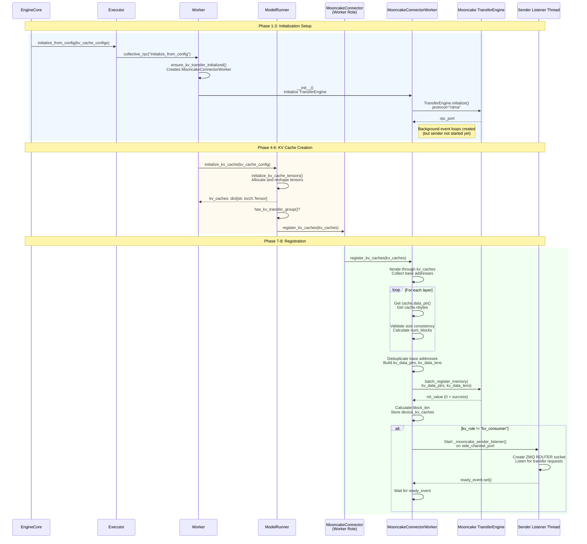

# MooncakeConnector `register_kv_caches` Workflow

This document describes the complete workflow for calling `register_kv_caches` in the MooncakeConnector, including the call chain, what happens during registration, and the initialization of background threads.

## Call Chain

```
EngineCore.__init__()
  └─> _initialize_kv_caches()
       └─> model_executor.initialize_from_config(kv_cache_configs)
            └─> Executor.collective_rpc("initialize_from_config", args=(kv_cache_configs,))
                 └─> Worker.initialize_from_config(kv_cache_config)
                      ├─> ensure_kv_transfer_initialized(vllm_config, kv_cache_config)
                      └─> model_runner.initialize_kv_cache(kv_cache_config)
                           └─> GPUModelRunner.initialize_kv_cache()
                                ├─> initialize_kv_cache_tensors()  # Creates KV cache tensors
                                └─> register_kv_caches(kv_caches)  # Registers with Mooncake
```

## Detailed Workflow

### Phase 1: Engine Initialization

**Location**: `vllm/v1/engine/core.py:220-277`

1. **EngineCore.__init__()** creates the model executor
2. **EngineCore._initialize_kv_caches()** is called:
   - Gets KV cache specs from model executor
   - Profiles GPU memory to determine available memory for KV cache
   - Generates KV cache configs based on available memory
   - Calls `model_executor.initialize_from_config(kv_cache_configs)`

### Phase 2: Executor RPC Call

**Location**: `vllm/v1/executor/abstract.py:110-116`

3. **Executor.initialize_from_config()** makes a collective RPC call:
   ```python
   self.collective_rpc("initialize_from_config", args=(kv_cache_configs,))
   ```
   This RPC call is executed on all workers in parallel.

### Phase 3: Worker Initialization

**Location**: `vllm/v1/worker/gpu_worker.py:394-411`

4. **Worker.initialize_from_config()** is called on each worker:
   - **First**, it calls `ensure_kv_transfer_initialized(vllm_config, kv_cache_config)`
     - This creates the MooncakeConnector if KV transfer is configured
     - The connector is created with `KVConnectorRole.WORKER`
     - `MooncakeConnectorWorker.__init__()` is called, which:
       - Initializes the Mooncake TransferEngine
       - Sets up topology information
       - Creates background event loops (but doesn't start sender listener yet)
   
   - **Then**, it calls `model_runner.initialize_kv_cache(kv_cache_config)`

### Phase 4: Model Runner KV Cache Initialization

**Location**: `vllm/v1/worker/gpu_model_runner.py:5648-5694`

5. **GPUModelRunner.initialize_kv_cache()** performs several steps:
   - Deep copies the KV cache config
   - Adds encoder-only layers if needed
   - Adds KV sharing layers if needed
   - Initializes attention backend
   - Prepares kernel block sizes
   - Initializes metadata builders
   - **Calls `initialize_kv_cache_tensors()`** to create the actual KV cache tensors

### Phase 5: KV Cache Tensor Creation

**Location**: `vllm/v1/worker/gpu_model_runner.py:5565-5614`

6. **GPUModelRunner.initialize_kv_cache_tensors()**:
   - Checks if uniform KV cache layout should be used (for cross-layer transfers)
   - If uniform: calls `allocate_uniform_kv_caches()` to create a single cross-layer tensor
   - Otherwise: allocates and reshapes individual layer tensors
   - Returns `kv_caches: dict[str, torch.Tensor]` mapping layer names to tensors

### Phase 6: Register KV Caches with Mooncake

**Location**: `vllm/v1/worker/gpu_model_runner.py:5685-5694`

7. **Check if KV transfer is enabled**:
   ```python
   if has_kv_transfer_group():
       kv_transfer_group = get_kv_transfer_group()
   ```

8. **Register KV caches**:
   - If using cross-layer KV cache:
     ```python
     kv_transfer_group.register_cross_layers_kv_cache(
         self.cross_layers_kv_cache, self.cross_layers_attn_backend
     )
     ```
   - Otherwise:
     ```python
     kv_transfer_group.register_kv_caches(kv_caches)
     ```

### Phase 7: MooncakeConnector Registration

**Location**: `vllm/distributed/kv_transfer/kv_connector/v1/mooncake_connector.py:173-175`

9. **MooncakeConnector.register_kv_caches()** delegates to worker:
   ```python
   def register_kv_caches(self, kv_caches: dict[str, torch.Tensor]):
       assert self.connector_worker is not None
       self.connector_worker.register_kv_caches(kv_caches)
   ```

### Phase 8: MooncakeConnectorWorker Registration

**Location**: `vllm/distributed/kv_transfer/kv_connector/v1/mooncake_connector.py:672-735`

10. **MooncakeConnectorWorker.register_kv_caches()** performs the actual registration:

    **Step 10a: Collect KV Cache Information**
    ```python
    kv_data_ptrs = []
    kv_data_lens = []
    seen_base_addresses = []
    ```
    - Iterates through all layer KV caches
    - For each layer, gets the base address (`cache.data_ptr()`)
    - Handles split K/V caches vs unified caches based on `kv_topo.split_k_and_v`
    - Deduplicates base addresses (multiple layers may share memory)
    - Validates that all tensors have the same size
    - Calculates `num_blocks` from the first tensor's shape
    - Validates block size matches expected `block_size`

    **Step 10b: Register Memory with Mooncake Engine**
    ```python
    ret_value = self.engine.batch_register_memory(kv_data_ptrs, kv_data_lens)
    if ret_value != 0:
        raise RuntimeError("Mooncake batch memory registration failed.")
    ```
    - Registers all KV cache memory regions with the Mooncake TransferEngine
    - This makes the memory accessible for RDMA/transfer operations
    - Stores base addresses in `self.kv_caches_base_addr`

    **Step 10c: Calculate Block Length**
    ```python
    assert tensor_size_bytes % self.num_blocks == 0
    self.block_len = tensor_size_bytes // self.num_blocks
    self.device_kv_caches = kv_caches
    ```
    - Calculates the size of a single block in bytes
    - Stores the KV cache dictionary for later use

    **Step 10d: Start Sender Listener (if not kv_consumer)**
    ```python
    if self.kv_role == "kv_consumer":
        return  # No need to launch server for D node
    
    ready_event = threading.Event()
    asyncio.run_coroutine_threadsafe(
        self._mooncake_sender_listener(
            ready_event, self.side_channel_port, self.tp_rank
        ),
        self.sender_loop,
    )
    ready_event.wait()  # Wait for listener ZMQ socket to be ready.
    ```
    - If this is a prefiller (or kv_both), starts the background sender listener
    - The sender listener listens on ZMQ socket for incoming transfer requests
    - Waits for the socket to be ready before returning

## Sequence Diagram



## Key Details

### Memory Registration

- **Purpose**: Makes GPU memory accessible for RDMA transfers
- **Method**: `MooncakeEngine.batch_register_memory(ptr_list, len_list)`
- **What it does**: Registers memory regions with the Mooncake engine so they can be used for zero-copy transfers
- **Validation**: Ensures all tensors have consistent sizes and block sizes

### Block Length Calculation

- `block_len = tensor_size_bytes // num_blocks`
- This is used later when building transfer parameters to calculate source/destination pointers for specific blocks

### Sender Listener Thread

- **Only started for prefiller roles** (`kv_producer` or `kv_both`)
- **Purpose**: Listen for incoming ZMQ requests from decoder instances
- **Port**: `side_channel_port + tp_rank` (unique per tensor parallel rank)
- **Protocol**: ZMQ ROUTER socket for handling multiple concurrent requests
- **Thread Safety**: Uses asyncio event loop in a separate thread

### Timing

- Registration happens **once** during engine initialization
- Must happen **after** KV cache tensors are allocated
- Must happen **before** any transfer operations
- The sender listener starts immediately after registration (for prefiller roles)

## Error Handling

- If `batch_register_memory` returns non-zero, raises `RuntimeError`
- Validates tensor size consistency (all must be same size)
- Validates block size matches expected value
- Validates `tensor_size_bytes % num_blocks == 0`

## Related Operations

After registration:
- `start_load_kv()` uses the registered base addresses to build transfer parameters
- `send_kv_to_decode()` uses `kv_caches_base_addr` to calculate source pointers
- `receive_kv()` uses `kv_caches_base_addr` to calculate destination pointers
