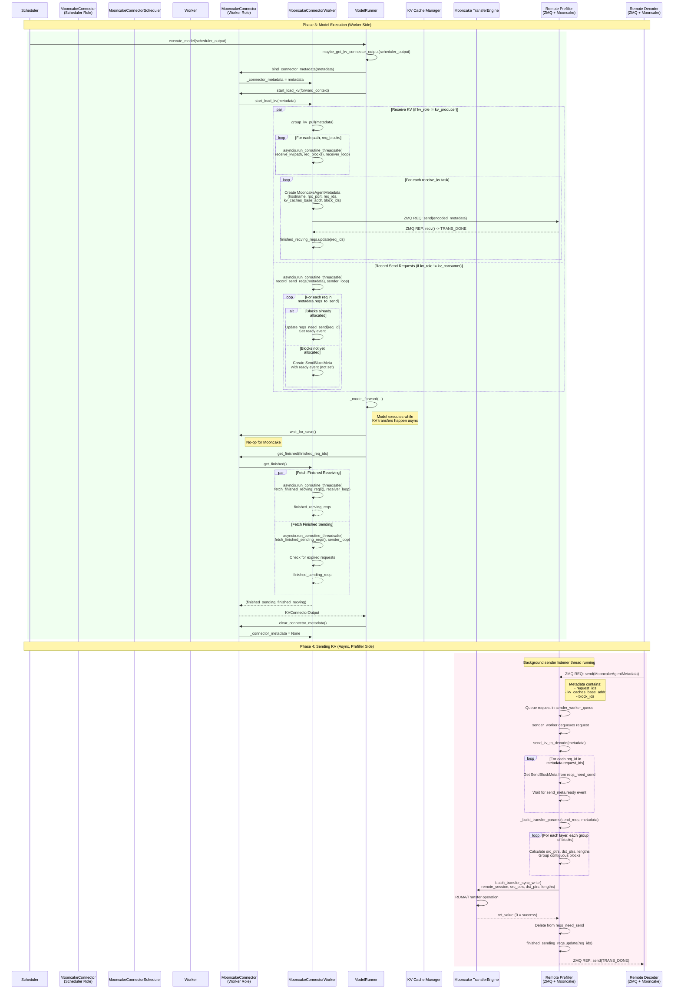

```mermaid
sequenceDiagram
    participant Scheduler
    participant SchedConnector as MooncakeConnector<br/>(Scheduler Role)
    participant SchedImpl as MooncakeConnectorScheduler
    participant Worker
    participant WorkerConnector as MooncakeConnector<br/>(Worker Role)
    participant WorkerImpl as MooncakeConnectorWorker
    participant ModelRunner
    participant KVManager as KV Cache Manager
    participant MooncakeEngine as Mooncake TransferEngine
    participant RemotePrefiller as Remote Prefiller<br/>(ZMQ + Mooncake)
    participant RemoteDecoder as Remote Decoder<br/>(ZMQ + Mooncake)

    Note over Scheduler,RemoteDecoder: Phase 3: Model Execution (Worker Side)
    rect rgb(240, 255, 240)
        Scheduler->>ModelRunner: execute_model(scheduler_output)
        ModelRunner->>ModelRunner: maybe_get_kv_connector_output(scheduler_output)
        ModelRunner->>WorkerConnector: bind_connector_metadata(metadata)
        WorkerConnector->>WorkerImpl: _connector_metadata = metadata

        ModelRunner->>WorkerConnector: start_load_kv(forward_context)
        WorkerConnector->>WorkerImpl: start_load_kv(metadata)
        
        par Receive KV (if kv_role != kv_producer)
            WorkerImpl->>WorkerImpl: group_kv_pull(metadata)
            loop For each path, req_blocks
                WorkerImpl->>WorkerImpl: asyncio.run_coroutine_threadsafe(<br/>receive_kv(path, req_blocks), receiver_loop)
            end
            
            loop For each receive_kv task
                WorkerImpl->>WorkerImpl: Create MooncakeAgentMetadata<br/>(hostname, rpc_port, req_ids,<br/>kv_caches_base_addr, block_ids)
                WorkerImpl->>RemotePrefiller: ZMQ REQ: send(encoded_metadata)
                RemotePrefiller-->>WorkerImpl: ZMQ REP: recv() -> TRANS_DONE
                WorkerImpl->>WorkerImpl: finished_recving_reqs.update(req_ids)
            end
        and Record Send Requests (if kv_role != kv_consumer)
            WorkerImpl->>WorkerImpl: asyncio.run_coroutine_threadsafe(<br/>record_send_reqs(metadata), sender_loop)
            loop For each req in metadata.reqs_to_send
                alt Blocks already allocated
                    WorkerImpl->>WorkerImpl: Update reqs_need_send[req_id]<br/>Set ready event
                else Blocks not yet allocated
                    WorkerImpl->>WorkerImpl: Create SendBlockMeta<br/>with ready event (not set)
                end
            end
        end

        ModelRunner->>ModelRunner: _model_forward(...)
        Note right of ModelRunner: Model executes while<br/>KV transfers happen async

        ModelRunner->>WorkerConnector: wait_for_save()
        Note right of WorkerConnector: No-op for Mooncake

        ModelRunner->>WorkerConnector: get_finished(finished_req_ids)
        WorkerConnector->>WorkerImpl: get_finished()
        par Fetch Finished Receiving
            WorkerImpl->>WorkerImpl: asyncio.run_coroutine_threadsafe(<br/>fetch_finished_recving_reqs(), receiver_loop)
            WorkerImpl-->>WorkerImpl: finished_recving_reqs
        and Fetch Finished Sending
            WorkerImpl->>WorkerImpl: asyncio.run_coroutine_threadsafe(<br/>fetch_finished_sending_reqs(), sender_loop)
            WorkerImpl->>WorkerImpl: Check for expired requests
            WorkerImpl-->>WorkerImpl: finished_sending_reqs
        end
        WorkerImpl-->>WorkerConnector: (finished_sending, finished_recving)
        WorkerConnector-->>ModelRunner: KVConnectorOutput

        ModelRunner->>WorkerConnector: clear_connector_metadata()
        WorkerConnector->>WorkerImpl: _connector_metadata = None
    end

    Note over Scheduler,RemoteDecoder: Phase 4: Sending KV (Async, Prefiller Side)
    rect rgb(255, 240, 245)
        Note over RemotePrefiller: Background sender listener thread running
        RemoteDecoder->>RemotePrefiller: ZMQ REQ: send(MooncakeAgentMetadata)
        Note right of RemotePrefiller: Metadata contains:<br/>- request_ids<br/>- kv_caches_base_addr<br/>- block_ids
        
        RemotePrefiller->>RemotePrefiller: Queue request in sender_worker_queue
        RemotePrefiller->>RemotePrefiller: _sender_worker dequeues request
        
        RemotePrefiller->>RemotePrefiller: send_kv_to_decode(metadata)
        loop For each req_id in metadata.request_ids
            RemotePrefiller->>RemotePrefiller: Get SendBlockMeta from reqs_need_send
            RemotePrefiller->>RemotePrefiller: Wait for send_meta.ready event
        end
        
        RemotePrefiller->>RemotePrefiller: _build_transfer_params(send_reqs, metadata)
        loop For each layer, each group of blocks
            RemotePrefiller->>RemotePrefiller: Calculate src_ptrs, dst_ptrs, lengths<br/>Group contiguous blocks
        end
        
        RemotePrefiller->>MooncakeEngine: batch_transfer_sync_write(<br/>remote_session, src_ptrs, dst_ptrs, lengths)
        MooncakeEngine->>MooncakeEngine: RDMA/Transfer operation
        MooncakeEngine-->>RemotePrefiller: ret_value (0 = success)
        
        RemotePrefiller->>RemotePrefiller: Delete from reqs_need_send
        RemotePrefiller->>RemotePrefiller: finished_sending_reqs.update(req_ids)
        RemotePrefiller-->>RemoteDecoder: ZMQ REP: send(TRANS_DONE)
    end
```